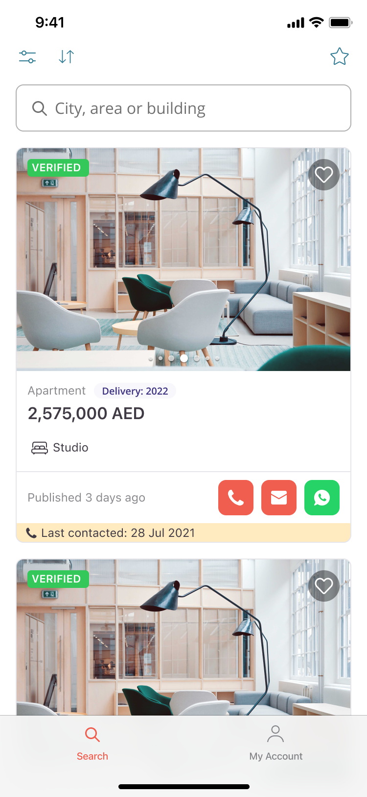

# Property Finder - Tech Interview

Congratulations! 🥳 
This is a **take‑home coding exercise** for the Property Finder iOS team. 
You have **up to 3 days** to work through the tasks below at your own pace.

---

Our idea is to evaluate your working style:
* **How you structure your code**
* **How you are tackling specific tasks**

We put together a very lite version of our beloved Property Finder application, with a simple backend functionality, tracking, logging, and all the other stuff... just basic UI of two out of many screens of the actual application.

---

## Table of Contents
- [Task 1 - Rebuild the following UI in SwiftUI](#task-1---rebuild-the-following-ui-in-swiftui)
- [Task 2 - Fetch listings and populate the Search screen](#task-2---fetch-listings-and-populate-the-search-screen)
- [Task 3 - Favourites and filtering](#task-3---favourites-and-filtering)
- [Bonus Task - Refactor the Settings screen](#bonus-task---refactor-the-settings-screen)
- [Sending the project file back in](#sending-the-project-file-back-in)

---

## Task 1 - Rebuild the following UI in SwiftUI



### Notes

* The list should scroll beneath the search bar
* Each button should only print a short statement to the console
* The carousel images are in Assets.xcassets

### Design Remarks
* Corner Radius: `Multiples of 4`
* Paddings: `Multiples of 4`
* Spacings: `Multiples of 4`

### Font Remarks
* Tags: `.caption2`
* "2,575,000 AED": `.headline`
* Everything else: `.caption`

---

## Task 2 - Fetch listings and populate the Search screen

In Task 1 you rebuilt the UI of the search screen. In this task, you will **back it with real data**.

We host a JSON payload that represents the list of properties shown in the screenshot at:

`https://simplejsoncms.com/api/m6nfoc4jlw`

Your job is to:

- **Fetch the data** from the hosted endpoint using `URLSession`
- **Populate the Search screen** with the decoded listings, including tags, meta information, and carousel images

### JSON shape

<details>
<summary>Click to view JSON contract</summary>

```json
{
  "listings": [
    {
      "id": "prop_001",
      "type": "Apartment",
      "deliveryYear": 2022,
      "price": 2575000,
      "currency": "AED",
      "priceInclusive": true,
      "location": "Laguna Tower, Lake Almas West, Jumeirah Lake Tower",
      "bedrooms": null,
      "bathrooms": 1,
      "areaSqft": 1356,
      "publishedAt": "2024-11-28T00:00:00Z",
      "lastContactedAt": "2021-07-28T00:00:00Z",
      "tags": ["verified", "new_construction", "live_viewing"],
      "images": ["FirstImage", "SecondImage"],
      "contactOptions": ["phone", "email", "whatsapp"]
    },
    {
      "id": "prop_002",
      "type": "Apartment",
      "deliveryYear": 2023,
      "price": 1850000,
      "currency": "AED",
      "priceInclusive": false,
      "location": "Marina Heights, Dubai Marina",
      "bedrooms": 1,
      "bathrooms": 2,
      "areaSqft": 980,
      "publishedAt": "2024-11-30T00:00:00Z",
      "lastContactedAt": null,
      "tags": ["verified"],
      "images": ["SecondImage", "FirstImage"],
      "contactOptions": ["phone", "whatsapp"]
    }
  ]
}
```

</details>

### Notes

- **Studio vs bedrooms**: `bedrooms: null` represents a Studio. Any integer value should be rendered as `"N Beds"`.
- **Carousel images**: `images` contains asset names from `Tahudu/Assets/Assets.xcassets/Carousel Images` (`FirstImage`, `SecondImage`). Use these to drive the image carousel.
- **Tags**: `tags` drives the badges on top of the image (`VERIFIED`, `NEW CONSTRUCTION`, `LIVE VIEWING`). Feel free to introduce an enum to map from the raw values to UI.
- **Relative dates**: `publishedAt` is an ISO‑8601 timestamp; compute a relative label such as “Published 3 days ago”.
- **Last contacted**: `lastContactedAt` is nullable. Only show the yellow “Last contacted …” banner when a value is present.
- **Contact options**: `contactOptions` indicates which contact buttons to show for each listing (phone, email, WhatsApp).
- **cURL Example**: You may use this `cURL` example to fetch the response to fill-up the data

`curl -X GET "https://simplejsoncms.com/api/m6nfoc4jlw"`

> [!IMPORTANT]
> Please refrain from using 3rd party libraries


---

## Task 3 - Favourites and filtering

Add **local favouriting** to the Search screen and a way to filter by favourites.

### Requirements

1. Tapping the heart icon on a listing card **toggles** it as a favourite.
2. Favourites are persisted **locally**.
3. Add a filter control on the first screen (the Search screen) that, when active, shows **only favourited listings**.
4. The filter state should be clearly visible so the user knows when they are viewing only favourites.

### Notes

- **Architecture**: Decide where the favouriting logic should live (view, view model, data layer, etc.) and structure your code accordingly.
- **Heart icon state**: The heart should visually reflect the current favourite state (e.g. filled vs outline).
- **User experience**: Feel free to add small UX touches (animations, empty‑state messaging) as long as the core behaviour is clear.

---

## Bonus Task - Refactor the Settings screen

The code within Screens/Settings could be written much nicer. Your task is to clean it up. 🧹

We will evaluate:

* **How you are tackling the refactor**
* **Outcome of the refactor**


> [!NOTE]
> Even if you didn't finish it, just writing comments over what you would've intended here and how should be enough

---

## Sending the project file back in

Once you are done with the exercises (within the **3-days** window), please share with us back the GitHub Repo you implemented the task on